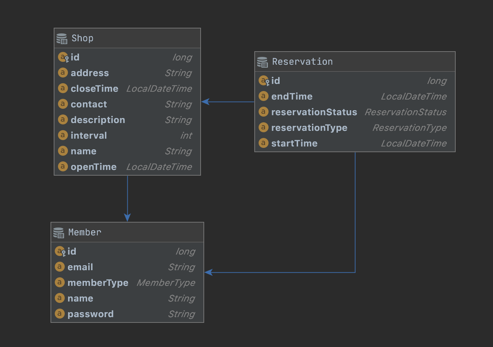

# 예약 시스템 with JPA 
> JPA를 활용해 간단한 예약 시스템을 위한 API를 구현해보자.

## 🗓 일정

- 2/4 - 요구사항 도출
- 2/8 - 엔티티/API 설계
- 2/15 - API 구현 1
  - 회원가입
  - 로그인 / 로그아웃
  - 서비스 목록
  - 예약 가능 시간 목록
- 2/22 - API 구현 2
  - 예약하기
  - 내 예약 목록 조회
  - 예약 취소
  - 예약 시간 변경

## 🧞‍♂️ 요구사항

#### **사용자**

- **관리자 : 예약 서비스를 제공하는 유저**
    - 한 관리자는 하나의 서비스만 제공한다.
    - 회원가입
        - 이메일, 이름, 비밀번호, 서비스 정보
    - 로그인/로그아웃
    - 고객 예약 정보 조회
        - 예약 시각, 고객 정보
- **일반 : 예약 서비스를 이용하는 유저**
    - 일반 유저는 여러 서비스에 예약 할 수 있다.
    - 한 서비스에 동시에 하나의 예약만 할 수 있다.
    - 회원가입
        - 이메일, 이름, 비밀번호
    - 로그인/로그아웃
    - 예약 하기
        - 카테고리 선택 ⇒ 서비스 선택 ⇒ 시간 선택 ⇒ 예약 완료
    - 예약 목록 보기
        - 서비스명, 날짜, 시간
    - 예약 취소 하기

#### **서비스**

- 이름, 상세설명, 주소, 번호
- 카테고리
    - 미용실
        - 영업 시간
        - 예약 가능한 시간
    - ~~숙박~~
        - ~~방 종류 한개~~
        - ~~하루 단위~~
        - ~~연속적인 날짜(최대 10일) 로 한번만 예약 가능~~
        - ~~방은 n 개~~

## 🎲 ERD

## 🎰 API

- 회원가입
- 로그인
- 로그아웃
- 서비스 목록
- 예약 가능 시간 목록
- 예약하기
- 내 예약 목록
- 예약 취소
- 예약 시간 변경

